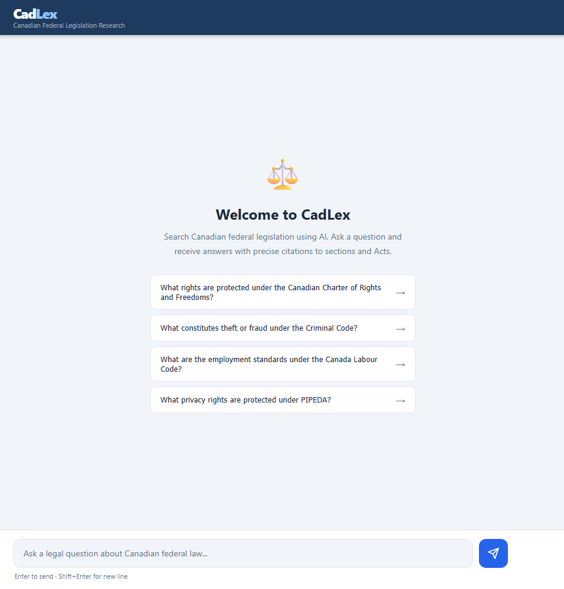
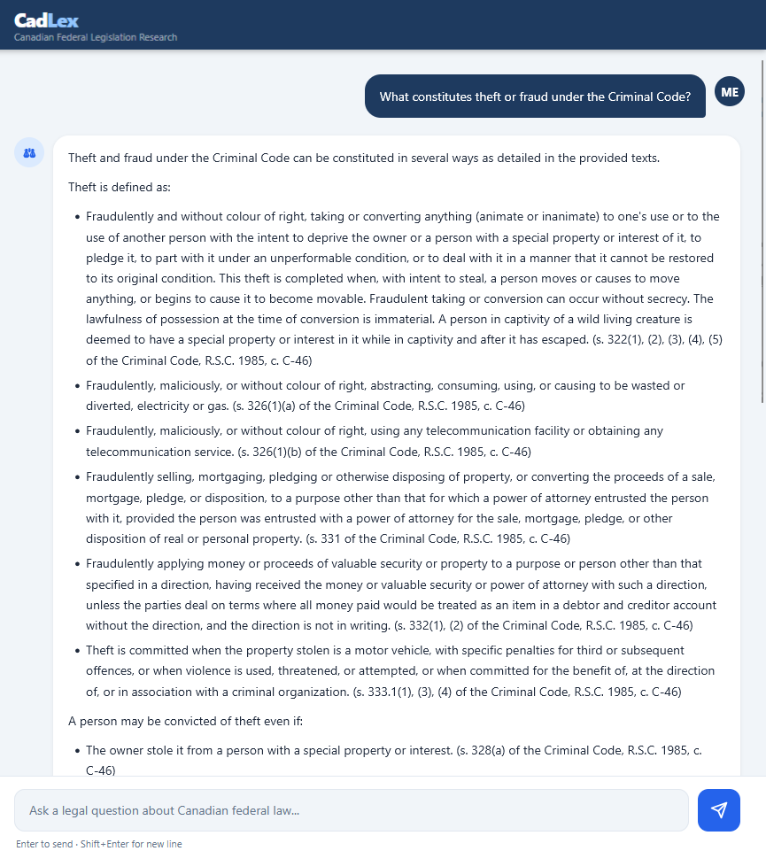
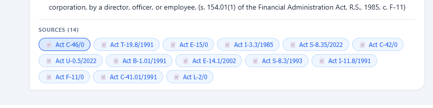
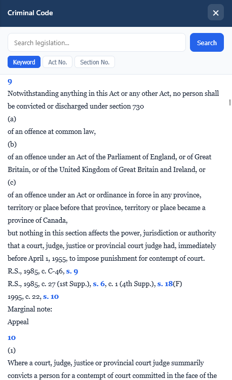

# CadLex — Canadian Federal Legislation Research Platform

**AI-powered legal research for Canadian federal statutes.**  
Ask plain-language questions; get cited, grounded answers drawn directly from the law.

> Personal project · Work in progress · Not legal advice

---

## What it does

CadLex ingests all 880+ consolidated statutes from the Government of Canada's [Justice Laws website](https://laws-lois.justice.gc.ca/), builds a local vector search index, and uses Google Gemini as a reasoning layer to answer questions with exact section citations. Every answer references the specific provision it drew from — no hallucinated statutes, no invented section numbers.

**Example questions the system answers well:**
- *"What rights does the Charter guarantee to someone under arrest?"*
- *"What is the penalty for theft over $5,000 under the Criminal Code?"*
- *"What are the minimum wage provisions in the Canada Labour Code?"*

---

## Architecture

```
Justice Laws XML feed
        │
        ▼
   collect.py          ← fetches act catalogue (~880 acts)
        │
        ▼
  fetch_text.py        ← downloads full HTML text, strips markup
        │
        ▼
  legislation.db       ← SQLite: metadata + full text
        │
        ▼
    index.py           ← chunks by section → embeds locally → stores in ChromaDB
        │
        ▼
  chroma_db/           ← ~60,000 section-level vectors (384-dim, cosine)
        │
        ▼
    app.py             ← FastAPI: RAG pipeline + SSE streaming
        │
        ▼
 static/index.html     ← single-page chat UI
```

Each user query triggers two Gemini API calls: one to decompose the question into 3–4 retrieval sub-queries, one to generate the grounded answer from retrieved chunks. Embeddings are computed locally (no data leaves the machine during indexing).

---

## AI Pipeline

### 1. Data collection
`collect.py` targets the Justice Laws XML autocomplete feed (`/js/lookup_acts_e.xml`) rather than the JavaScript-rendered index page — this gives a clean, structured catalogue of all active acts with their IDs, titles, and chapter references. Full text is fetched from each act's `FullText.html` endpoint with a 0.5 s rate limit.

### 2. Chunking & embedding
`index.py` splits each act's full text at numbered section boundaries (regex on patterns like `7  Fundamental justice`, `322  Definition of theft`). Sections over 2,000 characters are further split at subsection markers `(1)`, `(2)`, `(a)`, `(b)`. Each chunk gets a metadata header (`[ACT-C-46] Criminal Code...`) and is embedded with `paraphrase-multilingual-MiniLM-L12-v2` — a ~90 MB model that runs fully offline. Vectors are stored in ChromaDB with cosine similarity distance.

### 3. Query decomposition (Gemini)
The raw user question is sent to `gemini-2.5-flash-lite` with a structured prompt that asks for 3–4 keyword phrases matching the *vocabulary of the legislative text* (not conversational language). This materially improves recall: "rights if arrested" → `["right to retain counsel without delay", "arbitrary detention", "right to be informed of offence"]`.

### 4. Retrieval & deduplication
Each sub-query is embedded locally and searched against ChromaDB (top-20 per query). Results across all sub-queries are merged, deduplicated by chunk ID, and capped at 3 chunks per act to prevent any single verbose statute from dominating context. Three key statutes (Charter, Criminal Code, Canada Labour Code) bypass the cap and are always injected — this guarantees foundational law is represented regardless of query similarity scores.

### 5. Answer generation (Gemini)
Retrieved chunks are assembled into a context block and passed to Gemini with a strict system prompt: *answer only from the provided texts, cite every section explicitly, declare if the answer is not present*. The response streams token-by-token back to the browser via Server-Sent Events.

---

## Tech stack

| Component | Choice | Rationale |
|---|---|---|
| Database | SQLite | No config, no open ports, single file. Federal corpus (~880 acts) fits comfortably; migration to PostgreSQL is straightforward if needed. |
| Embeddings | `paraphrase-multilingual-MiniLM-L12-v2` | Free, local, 90 MB. Legislative text never leaves the machine during indexing. Multilingual support for future French-language acts. |
| Vector store | ChromaDB (local) | In-process, file-backed, no separate service. Index is a local directory. |
| LLM | Google Gemini 2.5 Flash Lite | Only user questions and already-public statutory text reach the API. Low cost per query; swap to Gemini 2.5 Pro for production. |
| Backend | FastAPI | Async SSE streaming, Pydantic input validation, minimal overhead. |
| Frontend | Vanilla JS + SSE | No framework overhead. `marked.js` for Markdown rendering of AI responses. |

---

## Setup

**Prerequisites:** Python 3.11+, a Google API key with Gemini access.

```bash
# 1. Clone and install dependencies
git clone https://github.com/yourname/canlex.git
cd canlex
pip install -r requirements.txt

# 2. Configure environment
cp .env.example .env
# Edit .env and set GOOGLE_API_KEY=...

# 3. Run the data pipeline (takes ~30–60 min for the full corpus)
python setup_db.py       # create legislation.db
python collect.py        # fetch act catalogue (~880 acts)
python fetch_text.py     # download full text (rate-limited to 0.5 s/request)

# If any acts show [NOT FOUND], fix and retry:
python fix_urls.py
python fetch_text.py

# 4. Build the vector index (downloads ~90 MB model on first run)
python index.py          # embeds ~60,000 chunks into ChromaDB

# 5. Validate with CLI
python query.py "What rights does the Charter guarantee?"

# 6. Start the web app
uvicorn app:app --host 0.0.0.0 --port 8000
# Open http://localhost:8000
```

---

## API

| Method | Endpoint | Description |
|---|---|---|
| `POST` | `/api/chat` | SSE stream. Body: `{"question": "..."}`. Events: `subqueries` → `token` (repeated) → `sources` → `done` |
| `GET` | `/api/norma/{identifier}` | Full record from DB. E.g. `/api/norma/ACT-C-46` |
| `GET` | `/api/search?q=...&tipo=keyword` | Keyword / act-ID / section search. `tipo`: `keyword`, `numero`, `artigo` |

---

## Screenshots

| | |
|---|---|
|  |  |
| Welcome screen with example questions | AI answer with section citations |
|  |  |
| Source attribution panel | Full-text viewer for cited acts |

---

## Roadmap

- [ ] Federal regulations corpus (1,400+ instruments via `/eng/regulations/`)
- [ ] Auth layer — OAuth / email magic link
- [ ] Rate limiting per IP, usage billing
- [ ] Upgrade to Gemini 2.5 Pro for production reasoning quality
- [ ] HTTPS termination, structured audit logs
- [ ] Cloud deployment with encrypted persistent storage

---

## Security notes

- The Google API key is loaded from `.env` at runtime; `.env` is gitignored and never committed.
- All SQL queries use parameterized statements — no user input is interpolated into query strings.
- Only user questions and retrieved statutory text (public domain) reach the Gemini API. No PII is collected or transmitted.
- The `ALLOWED_ORIGINS` environment variable restricts CORS in production (defaults to `*` for local development).
- Prompt injection risk is partially mitigated by separating the decomposition call (constrained JSON output) from the answer call (grounded in retrieved text only).

---

## Data source

All legislative data is sourced from the [Government of Canada Justice Laws website](https://laws-lois.justice.gc.ca/) and is in the public domain. This project is not affiliated with or endorsed by the Government of Canada or the Department of Justice.
